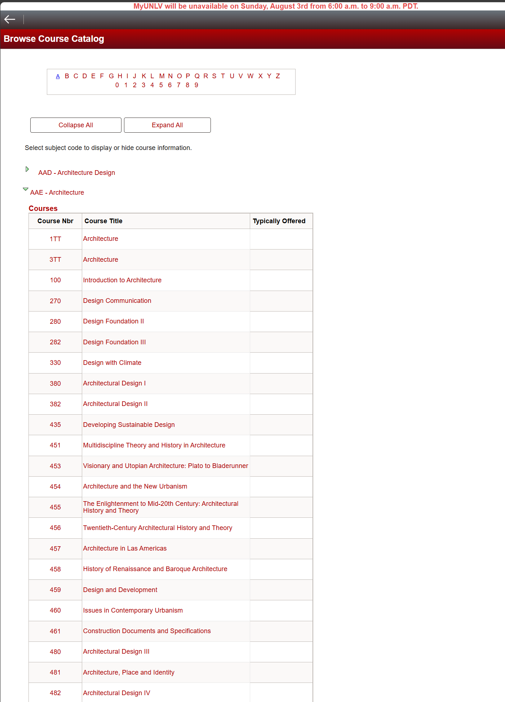
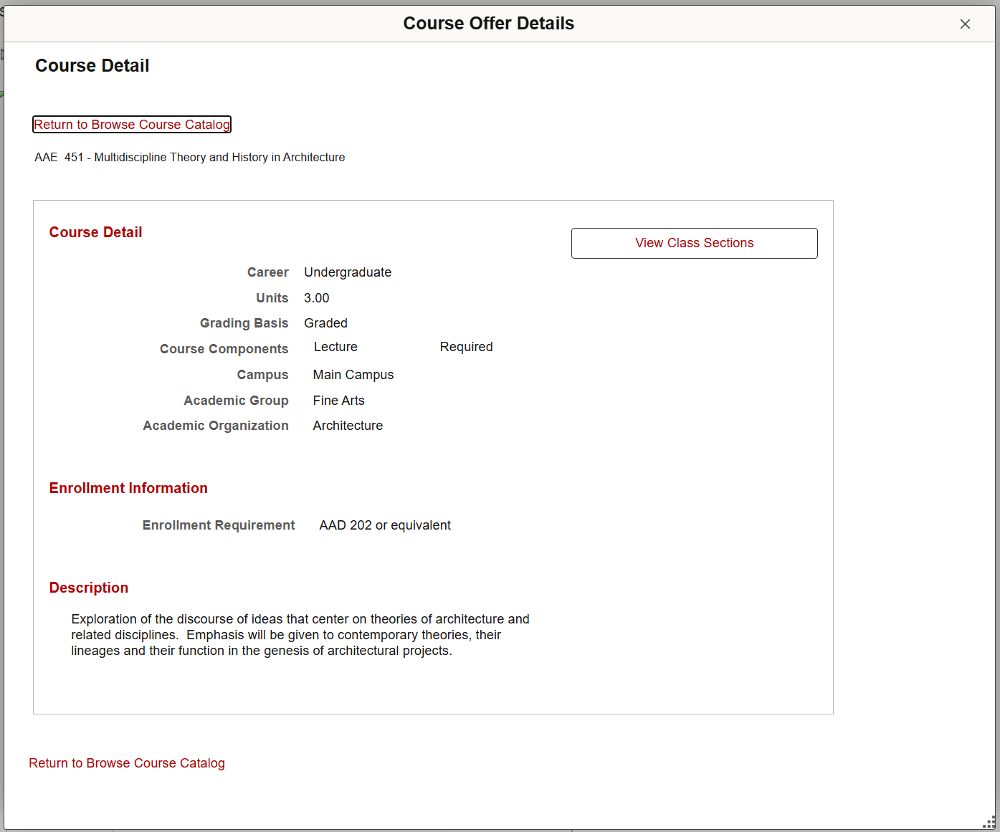

# 🕸️ Scraping UNLV Course Catalog

This folder contains the scripts and documentation used to scrape course and degree data from the UNLV course catalog as of **August 1, 2025**.

Our goal is to extract clean, structured data for:
- All courses offered by UNLV
- Prerequisite relationships between courses
- Degree programs
- 4-year plans of study

---

## 📸 Site Overview

### Course Listings

Each department has a page listing all its courses. These are typically grouped by subject prefix (e.g., `CS`, `MATH`, `ENG`).



---

### Course Detail Pages

Each course entry includes:
- Course ID and title
- Description
- Credit hours
- Prerequisites (in plain English)




## 🧾 Target Data Structure

We'll parse each course into a normalized format like:

```json
{
  "id": 1,
  "course_id": "CS 202",
  "course_number": "202",
  "course_subject": "CS - Computer Science",
  "title": "Computer Science II",
  "description": "Covers algorithms, data structures, and recursion...",
  "enrollment_information": "Enrollment Requirements CS 135/L with a grade of C or better. The maximum number of attempts for this course is three, including earned grades, withdrawals (W), and audits (AD).",
  "credits": {
    "min": 1,
    "max": 6,
  },
  "prerequisites": ["CS 135", "MATH 181"],
  "career": "Undergraduate",
  "grading_basis": "Graded",
  "course_components": "Lecture Required",
  "campus": "Main Campus",
  "academic_group": "Engineering",
  "academic_organization": "Computer Science",
  "raw": "Dump of raw scraping for debug"
}
---

## 🧩 Scraping Strategy (Loosely)

1. **Find Entry Points**
   - Collect all department pages from the homepage or catalog index.

2. **Scrape Course Listings**
   - For each department page, extract all course titles and their details.
   - Parse prerequisites from text using regular expressions or a simple parser.

3. **Scrape Degree Programs**
   - Follow degree program links.
   - Extract required courses and study plan sequences.

4. **Normalize & Save Data**
   - Store as JSON first
   - Later: insert into database (e.g., PostgreSQL)

5. **Handle Special Cases**
   - OR/AND logic in prerequisites
   - Cross-listed courses
   - Missing or ambiguous prerequisite formats

---

## 🧰 Tools Used

- `Python 3.x`
- `BeautifulSoup` (HTML parsing)
- `requests` (HTTP)
- `Playwright` (for JavaScript-rendered pages, if needed)
- `re` (regular expressions for parsing)

---

## 🗂️ File Structure

```
/scraping
├── screenshots/         # Site screenshots (for documentation)
├── course_scraper.py    # Main course scraping script
├── degree_scraper.py    # Main degree scraping script
├── parser.py            # Prerequisite parser logic
├── utils.py             # Helper functions
├── data/                # Scraped raw JSON output
└── readme.md            # This file
```

---

## 🧼 Notes

- We aim for clean, reusable, and minimal scraping.
- The scraper should be rerunnable in case the site changes or new courses are added.
- Consider implementing retry logic or caching to avoid hammering the server.

---

## ✅ Status

> As of **08/01/2025**, the scraping scripts are in early development. Focus is currently on parsing CS, MATH, and ENG departments.

---

## 📬 Contribute

If you'd like to help improve the scraper, feel free to fork the repo or open a pull request.
